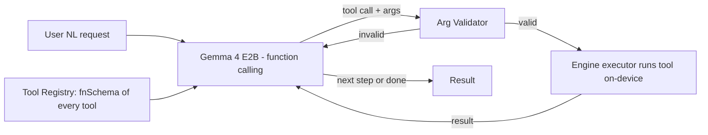

# Architecture

## Core idea: a pluggable tool registry (ported from Google AI Edge Gallery's `CustomTask`)

A 200+ tool app must never be a giant switch. Every tool self-registers as a module with metadata, an engine, an optional model, a UI, and a function schema. The home grid, search, and the Phase-3 agent all read the **same registry**.

```dart
enum EngineKind { pdf, image, ffmpeg, mlkit, onnx, asr, llm, dartlib }

abstract class ToolModule {
  ToolMeta   get meta;        // id, category, label, icon, description, tinywow slug
  EngineKind get engine;
  ModelSpec? get model;       // null for deterministic tools (Phase 1)
  Map<String, dynamic> get fnSchema;   // JSON-schema {name, description, params} — fed to agent (Phase 3)

  Future<void>  ensureReady();                         // e.g. trigger model download (Phase 2)
  Stream<ToolProgress> run(ToolInput input);           // streamed progress + result
  Widget buildScreen(BuildContext context);            // tool detail UI
}
```

- Registration via DI (`get_it` or `riverpod`): each module is bound into a `Set<ToolModule>`, auto-discovered (Gallery does this with Hilt `@IntoSet`).
- `EngineKind` selects the executor; executors are the only place that touch native plugins.
- Heavy `run()` work executes in an **isolate** (`compute`/`Isolate.run`) — UI never blocks.

```
lib/
  core/        registry, DI, isolate runner, file IO, share intents, result model
  engines/     pdf/ image/ ffmpeg/ mlkit/ onnx/ asr/ llm/   (one executor each)
  models/      model manager: manifest, downloader, verifier, cache, device gating (Phase 2)
  tools/       one ToolModule per tool, grouped by category (pdf/, image/, video/, file/, write/)
  agent/       Phase 3: gemma runtime, tool-call loop, arg validation, chain executor
  ui/          home grid, search, tool screen scaffold, settings, history
```

## Engine abstraction
| EngineKind | Plugin | Phase | Notes |
|---|---|---|---|
| `dartlib` | pure Dart (`csv`,`xml`,`excel_community`) | 1 | converters |
| `pdf` | `pdfrx` + `pdf` + native channel | 1 | D3: no Syncfusion |
| `image` | native platform-channel + `flutter_image_compress` | 1 | format/transform |
| `ffmpeg` | `ffmpeg_kit_flutter` (sk3llo LGPL fork) | 1 | D4: no fallback v1, isolate behind interface |
| `mlkit` | `google_mlkit_*` | 1.5 | segmentation (remove-bg), OCR |
| `onnx` | `onnxruntime` | 1.5 | upscale/inpaint/colorize; models via Phase 2 |
| `asr` | `sherpa_onnx` | 1.5 | transcription |
| `llm` | `flutter_gemma` (Gemma 4 E2B) | 3 | write tools + agent |

Each executor implements a tiny common contract (`prepare`, `execute(input)->stream`, `dispose`) so a tool body never imports a plugin directly — this is what makes the FFmpeg fallback swap (deferred) a one-file change.

## Phase 3 — on-device agent (D6)

- **Tier 3a:** map request → one tool + params. **Tier 3b:** 2–3 step chains (e.g. extract-audio → transcribe). Validated steps run automatically; Stop cancels a chain.
- **Mandatory:** validate every tool-call's args against `fnSchema` before running — a 2B model hallucinates args. Never execute unvalidated.
- No cloud planner, no open-ended autonomy.

## The LLM slot: load state and unload
`LlmEngine` holds exactly ONE model. Loading a `.litertlm` costs 1–4 GB of RAM and tens of seconds (weights map + GPU kernel build) with **no progress signal** from LiteRT-LM, so:
- Every transition is broadcast on `LlmEngine.statusStream` (`unloaded | loading | loaded`, with the task id and a start timestamp). `llmStatusProvider` re-emits once a second while loading so the UI can show elapsed time.
- Concurrent `ensureLoaded` calls **coalesce** (composer warm-up vs. Send): same configuration joins the in-flight load, a different one queues behind it. Two parallel native creates would be two multi-GB engines.
- A turn flips `busy` and persists the user's message *before* the load, so a cold start never looks like a frozen screen.
- `LlmEngine.unload()` (Settings → Models, or the Ask tab's model sheet) stops live generation, closes the conversations and frees the engine. It queues behind an in-flight load — tearing the engine down mid-create is a native crash.

## Background execution
Long jobs (an LLM turn, an ffmpeg transcode, a model download) must survive the user leaving the app. Android freezes cached processes and kills the biggest ones first, so `ForegroundKeepAlive` (`anvil/foreground` channel → `KeepAliveService`, type `dataSync`) holds the process in the foreground bucket with an ongoing notification for as long as a job is running.
- Holds are per-owner and idempotent (`chat`, `tool`, `download`); the service stops when the last owner releases.
- It protects the existing work; it does not move it. Nothing survives process death, and there is no resume — a killed turn restarts.

## What we reuse from Google AI Edge Gallery (Apache-2.0, Android/Kotlin)
We port **patterns**, not code (Gallery is Kotlin; we're Dart):
1. **`CustomTask` registry** → our `ToolModule` registry. The whole app skeleton.
2. **Model delivery** (`Model` + `DownloadWorker` + `ModelAllowlist`) → our `models/` manager (see MODEL_DELIVERY.md).
3. **Device gating** (`minDeviceMemoryInGb` + benchmark) → variant selection / graceful disable.
4. **Runtime abstraction** (`LlmModelHelper`, two backends) → our engine executor contract.
Gallery gives **nothing** for the 140 deterministic tools (not ML) — those are pure plugin integration.
